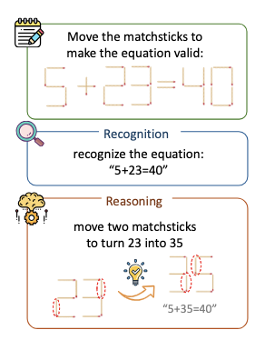
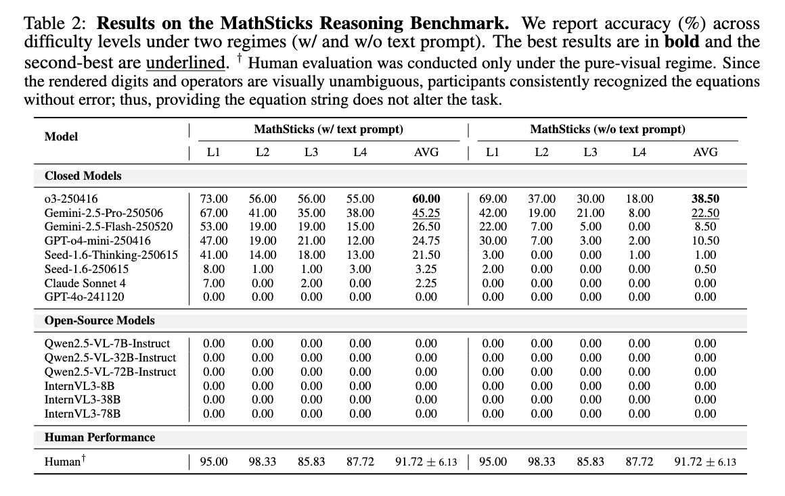
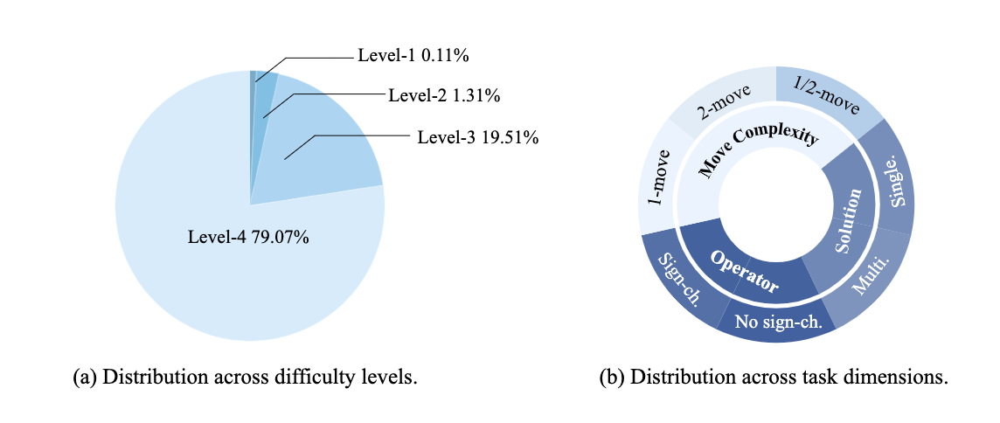

## MathSticks: A Benchmark for Visual Symbolic Compositional Reasoning with Matchstick Puzzles


### Overview
MathSticks is a benchmark for Visual Symbolic Compositional Reasoning (VSCR) that unifies visual perception, symbolic manipulation, and arithmetic consistency. Each task presents an incorrect matchstick equation in a seven-segment style. The goal is to move exactly one or two sticks—under strict stick-conservation and digit-legibility constraints—to make the equation mathematically correct.

- Two evaluation regimes:
  - Text-guided: the equation string is provided to the model.
  - Pure-visual: only the rendered puzzle image is provided.
- Systematic coverage: digit scale (Levels 1–4), move complexity (1/2 sticks), solution multiplicity, and operator variation.
- Scale: 1.4M generated instances; a curated test set of 400 items is released.

<p align="center">
  
  <br/>
  <em>Example: input puzzle, reasoning trace, and move-format predictions.</em>
  <br/>
</p>

Evaluations across 14 VLMs reveal substantial limitations: closed-source models succeed only on simple cases, open-source models fail in the pure-visual regime, while humans exceed 90% accuracy. These results establish MathSticks as a rigorous, diagnostic testbed for advancing compositional reasoning across vision and symbols.

**📄 Paper:** MathSticks: A Benchmark for Visual Symbolic Compositional Reasoning with Matchstick Puzzles [arXiv](https://arxiv.org/pdf/2510.00483?)

**🗂️ Dataset:** [yuheng2000/MathSticks](https://huggingface.co/datasets/yuheng2000/MathSticks)


### Task Definition
- Input: a rendered image of an incorrect equation composed of matchsticks (seven-segment digits). Optionally, a text equation string (text-guided regime).
- Constraints: move one or two sticks only; no addition/removal; preserve digit legibility.
- Objective: reach a valid arithmetic equation (addition or subtraction). Operator flips may be required by the minimal-move constraint in some cases.
- Output format: a boxed sequence of Move operations, e.g. `\boxed{Move(A0, C3)}` or `\boxed{Move(A0, C3), Move(E1, F4)}`.

### Repository Structure
- `image/` — Rendered images for the benchmark:
  - `level1/`, `level2/`, `level3/`, `level4/` correspond to increasing digit scale and difficulty.
- `MathSticks_bench_400.jsonl` — The released evaluation set (400 items).
- `match_gen_flt.py` — Data generator that enumerates positional encodings, validates solvability via 1- and 2-move searches, and saves JSONL.
- `eval.py` — Evaluation script to run a model on the benchmark.
- `cal_score.py` — Scoring script to parse predictions and compute accuracy.

### Data Format (Benchmark JSONL)
Each line is one sample with the following fields:
- `id` (string): unique sample identifier, e.g., `"00075585"`.
- `level` (int): difficulty level (1–4) indicating digit scale.
- `image` (string): image path relative to repo root, e.g., `level1/00075585_8-9=3.png`.
- `problem` (string): the displayed (incorrect) equation string, e.g., `8-9=3`.
- `solution_num` (list[int, int]): counts of solvable solutions by move budget `[one_move_count, two_move_count]`.
- `mode_1_solution` (list): list of one-move solutions. Empty when `solution_num[0] == 0`.
- `mode_2_solution` (list): list of two-move solutions. Each item has:
  - `solution` (string): corrected equation (e.g., `"8 - 6 = 2"`).
  - `moves` (list[string]): standardized move format strings, e.g., `["Move(B2, B5)", "Move(C3, C5)"]`.
- `option_answer` (object): order-invariant representation of moves, for robust parsing:
  - `mode_1` (list): each one-move answer as `{ "pick": [from_label], "place": [to_label] }`.
  - `mode_2` (list): each two-move answer as `{ "pick": [from_label_1, from_label_2], "place": [to_label_1, to_label_2] }`.

Example:
```json
{
  "id": "00075585",
  "level": 1,
  "problem": "8-9=3",
  "image": "level1/00075585_8-9=3.png",
  "solution_num": [0, 4],
  "mode_1_solution": [],
  "mode_2_solution": [
    {"solution": "8 - 6 = 2", "moves": ["Move(B2, B5)", "Move(C3, C5)"]},
    {"solution": "9 - 9 = 0", "moves": ["Move(A5, C5)", "Move(C0, C6)"]},
    {"solution": "6 + 3 = 9", "moves": ["Move(A2, G0)", "Move(B6, C6)"]},
    {"solution": "9 - 0 = 9", "moves": ["Move(A5, B5)", "Move(B0, C6)"]}
  ],
  "option_answer": {
    "mode_1": [],
    "mode_2": [
      {"pick": ["B2", "C3"], "place": ["B5", "C5"]},
      {"pick": ["A5", "C0"], "place": ["C5", "C6"]},
      {"pick": ["A2", "B6"], "place": ["G0", "C6"]},
      {"pick": ["A5", "B0"], "place": ["B5", "C6"]}
    ]
  }
}
```

Notes:
- Pure-visual regime uses only `image` for model input; text-guided may also use `problem`.
- The string move format is strict for parsing; `option_answer` provides an order-invariant equivalent when needed.


### Quick Start
1) Run evaluation
```bash
python eval.py \
  --input MathSticks_bench_400.jsonl \
  --image-dir ./image \
  --output predictions.jsonl
```

2) Score predictions
```bash
python cal_score.py \
  --pred predictions.jsonl \
  --label MathSticks_bench_400.jsonl \
  --output score.json
```

3) Generate data (research use only)
```bash
python match_gen_flt.py
```
This enumerates positional encodings and writes the discovered solvable cases to `match_gen.jsonl`. It is computationally intensive and may take a long time.


<p align="center">
  
  <br/>
  <em>Results summary across models and task regimes.</em>
  <br/>
</p>

### Evaluation Protocol
- For each item, the model must output a boxed `Move(...)` or a pair of moves in the specified format. The scorer checks both the semantic validity (correct final equation under the move constraints) and the exact output format.
- The benchmark separates text-guided vs pure-visual regimes to diagnose whether failures come from visual parsing or symbolic reasoning.
- We report overall accuracy and can break down by level (digit scale), move complexity, multiplicity, and operator variations.


### Baselines & Findings (Summary)
- 14 models evaluated, covering major closed-source and open-source VLM families.
- Closed-source models handle simple, single-move cases but degrade on two-move and operator-flip instances.
- Open-source VLMs struggle in the pure-visual regime, suggesting gaps in robust symbol-level perception.
- Human performance exceeds 90% accuracy, underscoring remaining headroom for VLMs.

<p align="center">
  
  <br/>
  <em>Statistics: coverage by digit level, move complexity, multiplicity, and operator flips.</em>
  <br/>
</p>

### Dataset Access
The released images and annotations for the 400-item evaluation set are provided in this repository (`image/` and `MathSticks_bench_400.jsonl`). The larger dataset is available on Hugging Face: [yuheng2000/MathSticks](https://huggingface.co/datasets/yuheng2000/MathSticks).

### Citation
If you find MathSticks useful, please cite (arXiv link TBD):
```
@article{mathsticks2025,
  title   = {MathSticks: A Benchmark for Visual Symbolic Compositional Reasoning with Matchstick Puzzles},
  author  = {Ji, Yuheng and Tan, Huajie and Chi, Cheng and Xu, Yijie and Zhao, Yuting and Zhou, Enshen and Lyu, Huaihai and Wang, Pengwei and Wang, Zhongyuan and Zhang, Shanghang and Zheng, xiaolong},
  journal = {arXiv preprint arXiv:2510.00483},
  year    = {2025}
}
```
